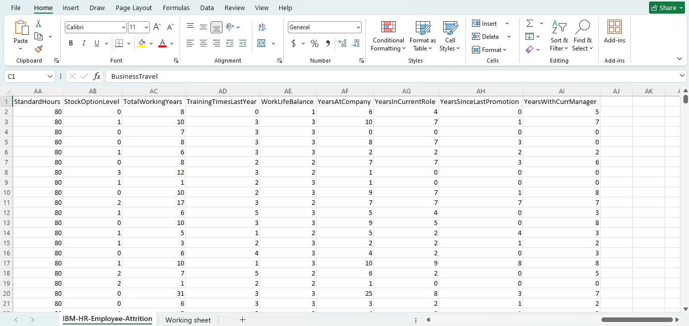
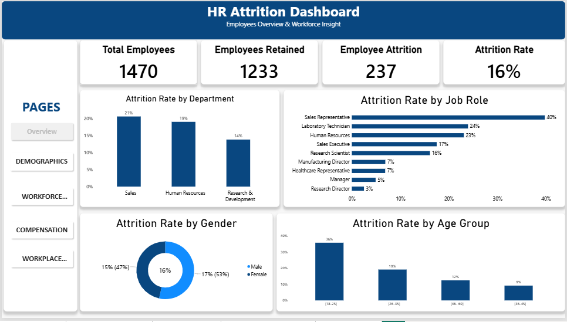
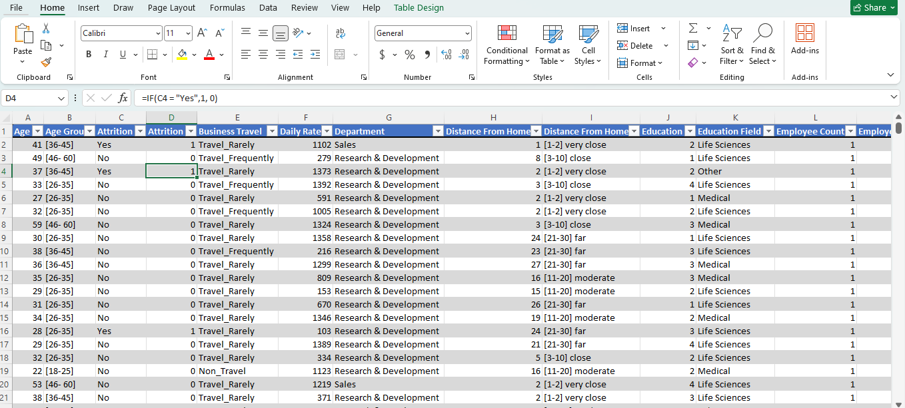
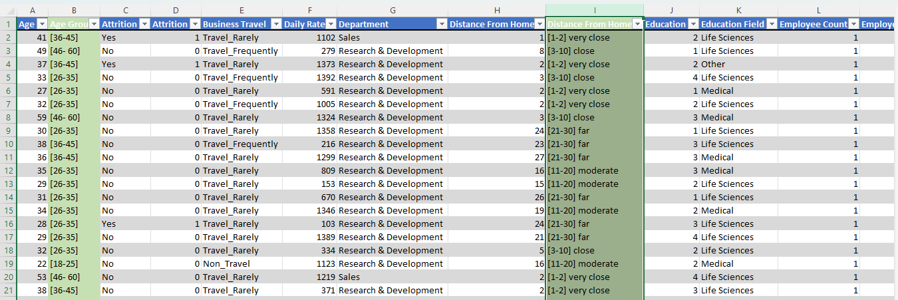
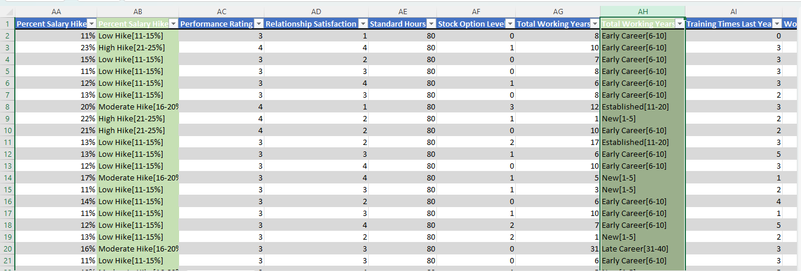
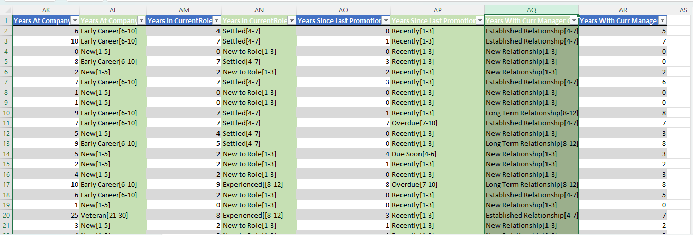
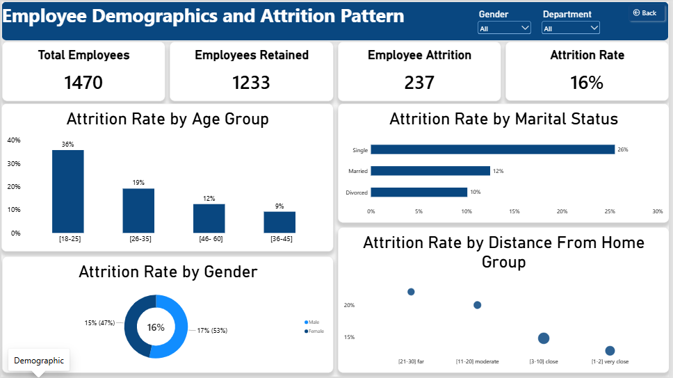
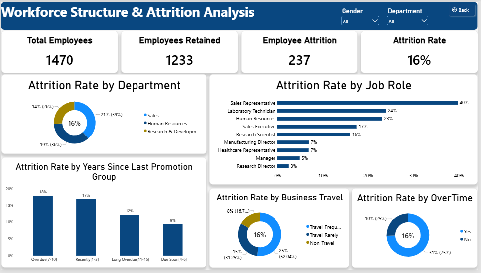
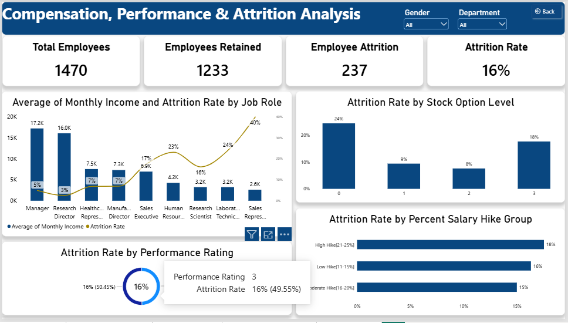
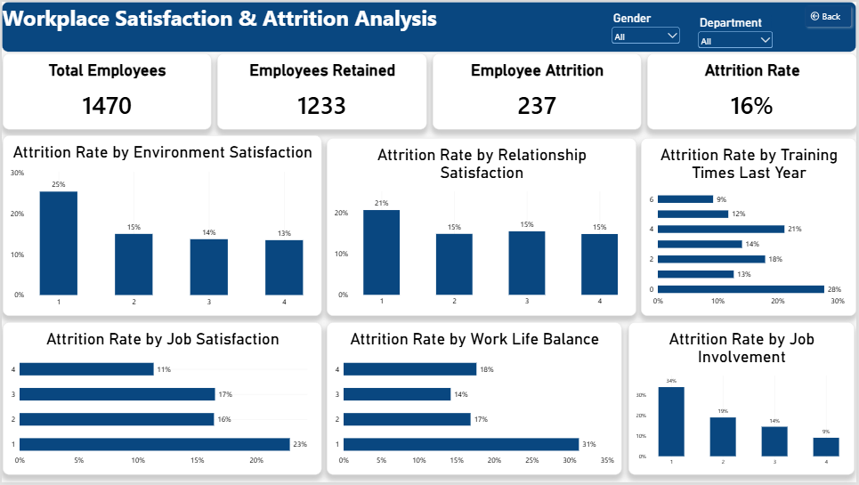

# HR Employee Attrition Analysis

HR Employee Attrition Analysis using Excel and Power BI.

## Project Overview

This project analyzes employee attrition patterns using an HR employee dataset. The analysis explores demographic, workforce, compensation, performance, and workplace satisfaction factors to identify patterns associated with employee turnover.

## Business Objective

The objective of this project is to understand employee attrition patterns and identify areas that may require further investigation to support employee retention and workforce management.

## Tools Used

- Microsoft Excel
- Power BI
- DAX

## Dataset

The dataset contains information on employee demographics, job roles, compensation, performance, workplace satisfaction, and attrition status.

## Dashboard Preview

## Data Cleaning & Preparation

The dataset was reviewed and prepared before analysis. The cleaning process included checking for:

- Duplicate records
- Missing values
- Inconsistent values
- Data types and formatting
- Percentage and numerical fields
- Grouping of age, distance-from-home, tenure-related (Total Working Years, Years at Company, Years in Current Role, Years Since Last Promotion, Years With Current Manager), and salary hike values for analysis

## Dashboard

The Power BI dashboard provides an executive-level overview of employee attrition using key performance indicators and selected visualizations.

### Key KPIs

- Total Employees: 1,470
- Employees Retained: 1,233
- Employees Who Left: 237
- Overall Attrition Rate: 16%

## Analysis & Findings

### 1. Employee Demographics & Attrition

This report examines attrition across age group, marital status, gender, and distance from home.

Key observations include higher observed attrition among younger employees, single employees, employees living farther from work, and a slightly higher rate among male employees.

### 2. Workforce Structure & Attrition

This report examines attrition across department, job role, years since last promotion, business travel, and overtime.

The analysis shows considerable variation across workforce groups, with particularly high observed attrition among some sales roles, frequent travelers, and employees working overtime.

### 3. Compensation, Performance & Attrition

This report examines attrition in relation to monthly income, stock option level, performance rating, and salary hike percentage.

The analysis shows considerable variation in attrition across job roles and income levels, while performance ratings and salary hike groups show relatively smaller differences.

### 4. Workplace Satisfaction & Attrition

This report examines attrition across environment satisfaction, relationship satisfaction, job satisfaction, work-life balance, job involvement, and training.

The analysis shows noticeable differences in observed attrition across several workplace satisfaction measures, particularly job involvement, environment satisfaction, and job satisfaction.

## Overall Key Findings

The analysis identified several notable patterns in employee attrition:

- Younger employees recorded higher observed attrition.
- Single employees recorded higher attrition than married and divorced employees.
- Overtime employees showed substantially higher attrition.
- Some sales-related roles recorded particularly high attrition.
- Employees with lower job involvement and satisfaction levels generally showed higher attrition.
- Compensation-related factors showed varying patterns, with no consistent trend across all measures.

These findings represent patterns observed in the dataset and do not establish direct causal relationships.

## Recommendations

Based on the combined findings, areas for further investigation include:

- Reviewing retention challenges among younger employees and high-attrition job roles.
- Investigating workload and overtime conditions.
- Examining employee job involvement and workplace satisfaction.
- Reviewing compensation and benefits across high-attrition roles.
- Further investigating promotion and career-development patterns.
- Using additional employee-level analysis to understand the factors associated with turnover.
  ## Project Files

- [Excel Workbook](Excel%20Workbook%28HR_Attrition_Analysis%29.xlsx) — cleaned data, pivot tables, and grouping formulas
- [Power BI Dashboard](Power%20BI%28HR_Attrition_Dashboard%29.pbix) — full four-page interactive dashboard

## Conclusion

This project demonstrates how Excel and Power BI can be used to transform an HR dataset into meaningful business insights. The analysis provides a structured view of employee attrition across demographic, workforce, compensation, performance, and workplace factors.

The findings can serve as a starting point for deeper investigation into employee retention and workforce management.
